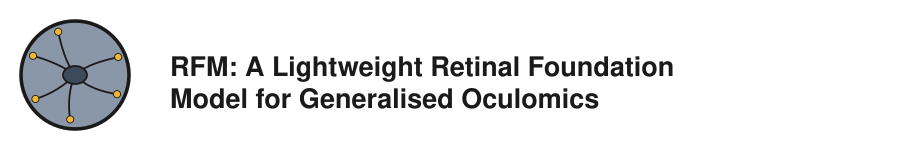

<p align="center">
  
</p>


<p align="center">
  <a href="https://www.medrxiv.org/content/10.64898/2026.10.02.26362554v1"></a>
  <a href="https://github.com/ok1zjf/RFM/actions/workflows/docker-build.yml"></a>
  <a href="https://github.com/ok1zjf/RFM/pkgs/container/rfm"></a>
  <a href="LICENSE"></a>
  
</p>

<!-- <p align="center"><strong>Pretrained retinal foundation model - train and evaluate classification heads on public DR and glaucoma benchmarks.</strong></p> -->

<p align="center">
  <a href="#installation">Installation</a> |
  <a href="#reproducing-the-paper-results">Reproduce</a> |
  <a href="#training-and-testing-from-scratch">Train</a> |
  <a href="#datasets">Datasets</a> |
  <a href="#evaluation-and-confidence-intervals">Evaluation</a> |
  <a href="#experiment-configuration">Configs</a> |
  <a href="#reproducibility">Reproducibility</a> |
  <a href="#predicting-on-your-own-images">Predict</a> |
  <a href="#using-rfm-as-a-feature-extractor">Extract Features</a> |
  <a href="#citation">Citation</a>
</p>

This repository is the official source code release accompanying the
publication **"RFM: A Lightweight Retinal Foundation Model for Generalised
Oculomics"**.

📄 Paper: [medRxiv preprint](https://www.medrxiv.org/content/10.64898/2026.10.02.26362554v1) (doi: [10.64898/2026.10.02.26362554](https://doi.org/10.64898/2026.10.02.26362554))

RFM is a 64-million-parameter retinal foundation model, pre-trained with the
LeJEPA joint-embedding predictive self-supervised objective on 4.3 million
colour fundus photographs from the North East London Diabetic Eye Screening
Programme (DESP). RFM is built on Meta's [DINOv3](https://github.com/facebookresearch/dinov3):
its pre-training starts from the DINOv3 ViT-B/16 weights, and the RFM weights
are therefore released under the [DINOv3 License](LICENSE-DINOv3.md) (see
[License](#license)).

## Contents

- [Overview](#overview)
- [Installation](#installation)
- [Reproducing the paper results](#reproducing-the-paper-results)
- [Training and testing from scratch](#training-and-testing-from-scratch)
- [Datasets](#datasets)
- [Evaluation and confidence intervals](#evaluation-and-confidence-intervals)
- [Experiment configuration](#experiment-configuration)
- [Reproducibility](#reproducibility)
- [Predicting on your own images](#predicting-on-your-own-images)
- [Using RFM as a feature extractor](#using-rfm-as-a-feature-extractor)
- [Repository layout](#repository-layout)
- [Citation](#citation) · [License](#license) · [Contact](#contact)

## Overview

This repository provides:

- Code to train and evaluate lightweight classification heads on top of
  **frozen backbones**, reproducing the paper's downstream evaluation on
  public benchmark datasets: the paper's pretrained RFM model, plus five
  additional baselines trained and evaluated the same way (see
  [Backbones](#backbones)).
- The pretrained RFM model weights (under the [DINOv3 License](LICENSE-DINOv3.md)).
- The trained classification head of every experiment in the paper
  (`released/`), so the published test results can be reproduced
  [without training](#reproducing-the-paper-results).
- The public benchmark datasets used in the paper, each with the
  train/validation/test split every experiment config uses by default (see
  [Datasets](#datasets)).

The RFM self-supervised (LeJEPA) pre-training code is not yet included and
will be provided in a subsequent update.

### Backbones

Every dataset is evaluated with each of six frozen backbones - 30
experiments in total (5 datasets x 6 backbone variants), one config per
experiment under `configs/experiment/<dataset>_<suffix>.yaml`:

| <sub>Backbone</sub> | <sub>Config suffix</sub> | <sub>Architecture</sub> | <sub>Weights file (`weights/`)</sub> | <sub>Input</sub> | <sub>Feature fed to the head</sub> |
|-----------------|-------------------|-----------------------------|--------------------------------------|------:|-----------------------------------------------------------|
| <sub>**RFM**</sub> | <sub>`_rfm`</sub> | <sub>ViT-B/16 (DINOv3)</sub> | <sub>`rfm-1.3.pt`</sub> | <sub>336</sub> | <sub>CLS + mean-pooled patch tokens of an intermediate block</sub> |
| <sub>DINOv3b-9L</sub> | <sub>`_dinov3b-9l`</sub> | <sub>ViT-B/16 (DINOv3)</sub> | <sub>`vit_base_patch16_dinov3.lvd1689m`</sub> | <sub>336</sub> | <sub>same as RFM, Meta's DINOv3 weights (LVD-1689M)</sub> |
| <sub>DINOv3</sub> | <sub>`_dinov3`</sub> | <sub>ViT-B/16 (DINOv3)</sub> | <sub>`vit_base_patch16_dinov3.lvd1689m`</sub> | <sub>336</sub> | <sub>final-layer global-pool features</sub> |
| <sub>RETFound-MAE</sub> | <sub>`_retfound_mae`</sub> | <sub>ViT-L/16</sub> | <sub>`RETFound_mae_natureCFP.pth`</sub> | <sub>224</sub> | <sub>RETFound-MAE's official linear-probe feature</sub> |
| <sub>RETFound-DINOv2</sub> | <sub>`_retfound_dinov2`</sub> | <sub>ViT-L/14</sub> | <sub>`RETFound_dinov2_meh.pth`</sub> | <sub>224</sub> | <sub>RETFound-DINOv2's official linear-probe feature</sub> |
| <sub>RETFound-Green</sub> | <sub>`_retfound_green`</sub> | <sub>ViT-S/14 (reg4)</sub> | <sub>`retfoundgreen_statedict.pth`</sub> | <sub>392</sub> | <sub>RETFound-Green's official feature</sub> |

The exact feature-extraction mode of each backbone is documented in
`model.py`. See [RETFound replication notes](RETFOUND_REPLICATION.md) for
backbone/checkpoint details and a methodology-level fidelity check against
each RETFound variant's official source code.

## Installation

Two options: a native conda environment, or a ready-made Docker image.
Either way, the last step is fetching the weights and datasets.

### Native

Clone the repository:

```bash
git clone https://github.com/ok1zjf/RFM.git
cd RFM
```

Requires Python 3.9+ and conda. Create an environment and install Pillow from
Anaconda's `pkgs/main` channel first, then PyTorch matching your CUDA version
(the example below is what produced the paper's results - see the
[PyTorch install matrix](https://pytorch.org/get-started/locally/) for other
CUDA versions or a CPU-only build), then the rest from
[`requirements.txt`](requirements.txt):

```bash
conda create -y -n rfm python=3.9
conda activate rfm
conda install -y --override-channels -c https://repo.anaconda.com/pkgs/main pillow=11.1.0 jpeg=9e
pip install torch==2.5.1 torchvision==0.20.1 --index-url https://download.pytorch.org/whl/cu124
pip install -r requirements.txt
```

### Docker

A Docker image is built automatically by GitHub Actions and published to
GHCR - no repository clone needed (except for
[re-testing the released heads](#reproducing-the-paper-results)).

**Prerequisites:**
- Docker Engine
- An NVIDIA GPU with drivers, plus the
  [NVIDIA Container Toolkit](https://docs.nvidia.com/datacenter/cloud-native/container-toolkit/latest/install-guide.html)
  installed (so `--gpus all` works) - or see
  [Running without a GPU](#running-without-a-gpu)

**Set up once:**

```bash
mkdir -p RFM/weights RFM/datasets RFM/outputs
mkdir -p ~/.config/kaggle && touch ~/.config/kaggle/kaggle.json
```

The second line is only needed for APTOS 2019/Messidor-2 (create an empty
placeholder now if you don't have a token yet, and fill it in later - if
your Kaggle CLI uses the older `~/.kaggle/kaggle.json` path instead, use
that path in the mount below).

Every command in this README is run inside the container by appending it
after the image name, with `RFM/` mounted as the container's data
directory:

```bash
docker run --rm --gpus all --shm-size=8g --user "$(id -u):$(id -g)" -e HOME=/tmp \
  -v "$(pwd)/RFM:/app/data" \
  ghcr.io/ok1zjf/rfm:latest <command>
```

Weights/datasets land in `RFM/weights`/`RFM/datasets`; training runs
(checkpoints, plots, logs) and the combined `results.pdf`/
`results_manifest.txt` land in `RFM/outputs`. The exact command for each
step is given in a collapsible **Docker** block below the native one.

### Fetching weights and datasets

One-shot setup:

```bash
./init.sh                    # pretrained RFM/DINOv3 weights + all 5 datasets
./init.sh --only papila      # just one dataset
```

<details>
<summary><b>Docker</b></summary>

```bash
docker run --rm --gpus all --shm-size=8g --user "$(id -u):$(id -g)" -e HOME=/tmp \
  -e HF_TOKEN="$HF_TOKEN" \
  -v "$(pwd)/RFM:/app/data" \
  -v "$HOME/.config/kaggle/kaggle.json:/tmp/.config/kaggle/kaggle.json:ro" \
  ghcr.io/ok1zjf/rfm:latest ./init.sh
```

`-e HF_TOKEN="$HF_TOKEN"` passes through the HuggingFace token from your
shell (see the RETFound note below); omit it if you don't need the RETFound
checkpoints yet.

Add `--only papila` (or any dataset name) to fetch just one.

</details>

The RFM backbone weights (`weights/rfm-1.3.pt`) can also be downloaded
directly: [rfm-1.3.pt](https://drive.google.com/uc?export=download&id=1YqWkop3vk4EajrdZ_KApsmg0QhGIhVVk).
The RFM and DINOv3 weights are distributed under the DINOv3 License, a copy
of which is downloaded next to them as `weights/LICENSE-DINOv3.md` (see
[License](#license)).

**Kaggle.** APTOS 2019 and Messidor-2 are distributed via Kaggle and need a
Kaggle account + API token (`kaggle.json`) available before this step - see
the [Kaggle API docs](https://www.kaggle.com/docs/api) for where to place it.

**RETFound checkpoints.** The RETFound-MAE and RETFound-DINOv2 checkpoints
are hosted on gated HuggingFace repos
([`RETFound_mae_natureCFP`](https://huggingface.co/YukunZhou/RETFound_mae_natureCFP),
[`RETFound_dinov2_meh`](https://huggingface.co/YukunZhou/RETFound_dinov2_meh)):
log in, request access on each model page, create a token at
[huggingface.co/settings/tokens](https://huggingface.co/settings/tokens),
then `export HF_TOKEN=hf_...` before running `./init.sh` (or
`./download_weights.sh`). Without it, those two are skipped with an
explanatory error and everything else still downloads; re-run
`./download_weights.sh` once `HF_TOKEN` is set to fetch just the rest.

See [Datasets](#datasets) for where each dataset comes from and how it is
laid out on disk.

## Reproducing the paper results

`released/` ships, for every experiment, the run's `config.yaml` and its
trained head (`checkpoints/best.pt`, the epoch selected on validation
AUROC), a few tens of kilobytes each.
The frozen backbone itself is loaded from `weights/`, and the test
splits come from `datasets/` and the split CSVs. So after
[fetching weights and datasets](#fetching-weights-and-datasets) you can
skip training entirely:

```bash
./test.sh --manifest released/results_manifest.txt
```

<details>
<summary><b>Docker</b></summary>

```bash
docker run --rm --gpus all --shm-size=8g --user "$(id -u):$(id -g)" -e HOME=/tmp \
  -v "$(pwd)/RFM:/app/data" \
  -v "$(pwd)/released:/app/released" \
  ghcr.io/ok1zjf/rfm:latest ./test.sh --manifest released/results_manifest.txt
```

This needs the repository's `released/` directory on the host (from a `git
clone`) mounted over the image's copy, so the test results are written to
the host.

</details>

This evaluates all 30 released heads on their held-out test splits and writes,
next to each `config.yaml`, the same `test.csv`/`test_images.csv`/plots a
training run produces, plus a summary `released/results.pdf` and logs under
`released/logs/`. Your own training runs in `outputs/` are untouched, so you
can also test both sets. To restrict it to one dataset, filter the manifest
first:

```bash
grep papila released/results_manifest.txt > released/results_papila.txt
./test.sh --manifest released/results_papila.txt   # -> released/results_papila.pdf
```

Results are deterministic given the same weights and datasets, and were
checked to match the original full-model checkpoints exactly (identical
per-image probabilities and test metrics) on the machine that produced them;
expect tiny floating-point differences on other GPUs (see
[Reproducibility](#reproducibility)).

### Expected results

Test AUROC (macro one-vs-rest) with 95% bootstrap confidence interval of
each released head, as `./test.sh --manifest released/results_manifest.txt`
reports it on the [reference machine](#reference-environment):

| <sub>Dataset</sub> | <sub>RFM</sub> | <sub>DINOv3b-9L</sub> | <sub>DINOv3</sub> | <sub>RETFound-MAE</sub> | <sub>RETFound-DINOv2</sub> | <sub>RETFound-Green</sub> |
|------------|--------------------:|--------------------:|--------------------:|--------------------:|--------------------:|--------------------:|
| <sub>Messidor-2</sub> | <sub>0.870 (0.841–0.894)</sub> | <sub>0.861 (0.835–0.885)</sub> | <sub>0.835 (0.811–0.859)</sub> | <sub>0.805 (0.776–0.832)</sub> | <sub>0.826 (0.798–0.853)</sub> | <sub>0.855 (0.832–0.878)</sub> |
| <sub>APTOS 2019</sub> | <sub>0.946 (0.935–0.957)</sub> | <sub>0.942 (0.931–0.952)</sub> | <sub>0.933 (0.923–0.944)</sub> | <sub>0.925 (0.912–0.936)</sub> | <sub>0.922 (0.910–0.935)</sub> | <sub>0.940 (0.929–0.950)</sub> |
| <sub>IDRiD</sub> | <sub>0.825 (0.771–0.880)</sub> | <sub>0.842 (0.794–0.887)</sub> | <sub>0.796 (0.742–0.850)</sub> | <sub>0.754 (0.697–0.810)</sub> | <sub>0.774 (0.712–0.835)</sub> | <sub>0.814 (0.769–0.858)</sub> |
| <sub>PAPILA</sub> | <sub>0.833 (0.712–0.941)</sub> | <sub>0.753 (0.636–0.869)</sub> | <sub>0.764 (0.648–0.871)</sub> | <sub>0.737 (0.632–0.840)</sub> | <sub>0.801 (0.667–0.918)</sub> | <sub>0.797 (0.678–0.901)</sub> |
| <sub>GFID</sub> | <sub>0.957 (0.944–0.969)</sub> | <sub>0.921 (0.900–0.939)</sub> | <sub>0.893 (0.870–0.915)</sub> | <sub>0.919 (0.899–0.937)</sub> | <sub>0.917 (0.897–0.936)</sub> | <sub>0.910 (0.888–0.931)</sub> |

<details>
<summary>Test AUPRC (macro)</summary>

| <sub>Dataset</sub> | <sub>RFM</sub> | <sub>DINOv3b-9L</sub> | <sub>DINOv3</sub> | <sub>RETFound-MAE</sub> | <sub>RETFound-DINOv2</sub> | <sub>RETFound-Green</sub> |
|------------|--------------------:|--------------------:|--------------------:|--------------------:|--------------------:|--------------------:|
| <sub>Messidor-2</sub> | <sub>0.631 (0.537–0.732)</sub> | <sub>0.614 (0.524–0.715)</sub> | <sub>0.604 (0.523–0.682)</sub> | <sub>0.467 (0.414–0.560)</sub> | <sub>0.477 (0.421–0.568)</sub> | <sub>0.607 (0.524–0.685)</sub> |
| <sub>APTOS 2019</sub> | <sub>0.706 (0.669–0.756)</sub> | <sub>0.672 (0.639–0.714)</sub> | <sub>0.637 (0.606–0.679)</sub> | <sub>0.629 (0.597–0.675)</sub> | <sub>0.620 (0.586–0.669)</sub> | <sub>0.651 (0.619–0.697)</sub> |
| <sub>IDRiD</sub> | <sub>0.551 (0.484–0.658)</sub> | <sub>0.534 (0.468–0.640)</sub> | <sub>0.497 (0.434–0.593)</sub> | <sub>0.455 (0.397–0.550)</sub> | <sub>0.472 (0.406–0.572)</sub> | <sub>0.500 (0.442–0.589)</sub> |
| <sub>PAPILA</sub> | <sub>0.720 (0.613–0.857)</sub> | <sub>0.582 (0.475–0.722)</sub> | <sub>0.582 (0.478–0.699)</sub> | <sub>0.552 (0.455–0.669)</sub> | <sub>0.705 (0.590–0.837)</sub> | <sub>0.641 (0.524–0.775)</sub> |
| <sub>GFID</sub> | <sub>0.888 (0.851–0.921)</sub> | <sub>0.821 (0.779–0.862)</sub> | <sub>0.768 (0.726–0.813)</sub> | <sub>0.802 (0.762–0.846)</sub> | <sub>0.802 (0.760–0.844)</sub> | <sub>0.790 (0.747–0.836)</sub> |

</details>

All other metrics (accuracy, balanced accuracy, F1, precision, recall) are
in each run's `test.csv` and in `released/results.pdf`.

## Training and testing from scratch

**Train + test all experiments:**

```bash
./train_test.sh                        # all 30 experiments (5 datasets x 6 backbone variants)
./train_test.sh papila_rfm             # just one config
./train_test.sh --dataset messidor     # all 6 variants for one dataset
```

<details>
<summary><b>Docker</b></summary>

```bash
docker run --rm --gpus all --shm-size=8g --user "$(id -u):$(id -g)" -e HOME=/tmp \
  -v "$(pwd)/RFM:/app/data" \
  ghcr.io/ok1zjf/rfm:latest ./train_test.sh
```

Append any `train_test.sh` argument after the image name, e.g.
`./train_test.sh papila_rfm trainer.max_epochs=1` for a single quick run, or
`./train_test.sh --dataset messidor` for all 6 variants of one dataset.

</details>

This trains each head, evaluates it on the held-out test split, and compiles
a combined `outputs/results.pdf` report (`outputs/results_manifest.txt`
records every run directory). Every artifact these scripts produce -
per-run checkpoints/plots, logs, the manifest, the PDF - lands under
`outputs/`. Any config value can be overridden on the command line (see
[Experiment configuration](#experiment-configuration)).

**Re-test already-trained heads** without retraining (e.g. after a
metrics/reporting-only code change):

```bash
./test.sh                     # re-test every run in outputs/results_manifest.txt
./test.sh --dataset messidor  # just one dataset's runs
```

<details>
<summary><b>Docker</b></summary>

```bash
docker run --rm --gpus all --shm-size=8g --user "$(id -u):$(id -g)" -e HOME=/tmp \
  -v "$(pwd)/RFM:/app/data" \
  ghcr.io/ok1zjf/rfm:latest ./test.sh
```

</details>

### Approximate compute

Measured over 3 training epochs plus the test step of each backbone on
Messidor-2 (977 train + 246 val images, 521
test images), on one RTX 4090 of the [reference machine](#reference-environment).
The scripts run experiments one after another on a single GPU.

| Backbone                      | Batch | Epochs | Time / epoch (Messidor-2) | Peak GPU memory |
|-------------------------------|------:|-------:|--------------------------:|----------------:|
| RFM, DINOv3b-9L, DINOv3       |    64 |    200 |                    ~8-9 s |           ~5 GB |
| RETFound-MAE, RETFound-DINOv2 |    24 |     50 |                      ~6 s |         ~5-6 GB |
| RETFound-Green                |    64 |    200 |                     ~10 s |           ~7 GB |

Epoch time scales roughly with a dataset's train + val image count (from
~390 images for PAPILA to ~2,560 for APTOS 2019). Extrapolating, one full
`./train_test.sh` over all 30 experiments takes on the order of **10 hours**
on a single RTX 4090 - about 2-2.5 hours per DINOv3-based or RETFound-Green
backbone and under half an hour per ViT-L RETFound backbone (fewer epochs).
The test step after training takes about 1 minute per backbone, mostly
spent on the 4000-replicate bootstrap CIs and plots, so
[re-testing all 30 released heads](#reproducing-the-paper-results) takes
about 30-35 minutes. A GPU with 12 GB or more is enough for every experiment
at the configured batch sizes.

### Output directory structure

```
outputs/
├── <experiment_name>/<date>/<time>/     # one directory per training run
│   ├── config.yaml                      # fully resolved Hydra config for this run
│   ├── train.log                        # training console log
│   ├── checkpoints/{best,last}.pt       # trained head only (+ backbone name); best = top validation score
│   ├── results.csv                      # per-epoch train loss + validation metrics
│   ├── test.csv                         # final held-out test metrics with bootstrap CIs (one row, see below)
│   ├── test_images.csv                  # per-test-image id, true/predicted label, per-class probabilities
│   ├── <phenotype>_roc_curve.png        # per-class ROC curve
│   ├── <phenotype>_pr_curve.png         # per-class precision-recall curve
│   └── <phenotype>_confusion_matrix.png
├── logs/                                # train_test.sh / test.sh's own console logs
├── results_manifest.txt                 # one run directory per line, appended after each run
└── results.pdf                          # summary table + per-experiment plots, built from results_manifest.txt
```

`--dataset <name>` writes `results_<name>.txt`/`results_<name>.pdf` instead
of the combined manifest/PDF, leaving those untouched. A custom `--manifest`
does the same under whatever name you give it.

## Datasets

The datasets cover two disease areas, diabetic retinopathy (DR) and
glaucoma:

| Dataset    | Disease area | Download          | Images | Patients | Categories                      | Country     |
|------------|--------------|-------------------|-------:|---------:|---------------------------------|-------------|
| [APTOS 2019](https://www.kaggle.com/competitions/aptos2019-blindness-detection) | DR           | [Kaggle](https://www.kaggle.com/competitions/aptos2019-blindness-detection)            |  3,662 |       NA | 5 DR grades                     | India       |
| [IDRiD](https://ieee-dataport.org/open-access/indian-diabetic-retinopathy-image-dataset-idrid)      | DR           | [Zenodo mirror](https://zenodo.org/api/records/17219542/files/B.%20Disease%20Grading.zip/content)     |    516 |       NA | 5 DR grades                     | India       |
| [Messidor-2](https://www.adcis.net/en/third-party/messidor2/) | DR           | [Kaggle mirror](https://www.kaggle.com/datasets/mariaherrerot/messidor2preprocess)     |  1,744 |      874 | 5 DR grades                     | France      |
| [PAPILA](https://doi.org/10.1038/s41597-022-01388-1)     | Glaucoma     | [figshare](https://ndownloader.figshare.com/files/35013982)          |    488 |      244 | Healthy / Glaucoma / Suspicious | Spain       |
| [GFID](https://doi.org/10.7910/DVN/1YRRAC)       | Glaucoma     | [Harvard Dataverse](https://dataverse.harvard.edu/api/access/datafile/3314942) |  1,544 |       NA | Normal / Early / Advanced       | South Korea |

The Dataset column links to each dataset's official source page; NA means no
patient identifier is published for that dataset (for GFID the source paper
reports one photo per patient, so its image count is a patient count in
practice). `download_datasets.sh` fetches all five (see [Fetching weights and
datasets](#fetching-weights-and-datasets) above): PAPILA and GFID need no account;
APTOS 2019 and Messidor-2 need a Kaggle account + API token, and APTOS
additionally needs a one-time "Join Competition" click; IDRiD's download
link above is an unofficial CC-BY-4.0 Zenodo re-host, since the official
IEEE DataPort source needs a login the CLI can't automate (`--official`
prints instructions for it instead). Image and patient counts are taken
from this repository's split CSVs (see [Dataset statistics](#dataset-statistics)).

### Layout on disk

`prepare_datasets.sh` converts each raw download into `datasets/<name>/`, laid
out as flatly as the source allows - a single `images/` directory wherever
filenames are globally unique, subdirectories only where they are not:

```
datasets/
├── aptos-2019/images/002c21358ce6.jpg
├── messidor2/images/20051020_44284_0100_PP.png
├── papila/images/RET027OD.jpg
├── gfid/{normal,early,advanced}/1.png
└── idrid/{train,test}/IDRiD_001.jpg
```

GFID keeps class directories because its filenames are bare numbers that repeat
across classes (467 would collide). IDRiD keeps its official `train/`/`test/`
sets as directories because 103 of its 516 filenames occur in both (e.g.
`IDRiD_019.jpg`). Its `e` rows are exactly the `test/` directory, and train/val
is drawn at random within `train/`.

The train/val/test split is stored in the `split` column of the CSVs
(`t`/`v`/`e`) and the label in the phenotype column, so a split can be redrawn
without moving any images.

### Splits

Each dataset ships the single split CSV its experiment configs use
(`data.csv_path`, `images_root` alongside it):

| Dataset    | Split CSV                      |
|------------|--------------------------------|
| PAPILA     | `datasets/papila_splits.csv`     |
| Messidor-2 | `datasets/messidor2_splits.csv`  |
| APTOS 2019 | `datasets/aptos-2019_splits.csv` |
| IDRiD      | `datasets/idrid_splits.csv`      |
| GFID       | `datasets/gfid_splits.csv`       |

These are independently regenerated splits, patient-grouped where patient
identity is recoverable and class-stratified random where it isn't:

- PAPILA, Messidor-2 - grouped so both eyes of a patient/exam always land in
  the same split, removing the fellow-eye leakage the original RETFound
  splits contain (PAPILA via patient id + laterality encoded in the
  filename; Messidor-2 via the official ADCIS exam-pairing spreadsheet,
  `datasets/messidor2_pairs.csv`, which is also read at evaluation time for
  the patient-clustered bootstrap CI - see [Bootstrap confidence
  intervals](#bootstrap-confidence-intervals)).
- APTOS 2019, IDRiD, GFID - class-stratified random splits (seed 42). These
  three publish no patient identifier at all, so grouping isn't possible; for
  GFID the source paper reports one photo per patient, which makes an
  image-level split a patient-level one anyway. IDRiD's split keeps its
  officially published Testing Set intact as the test split and redraws only
  the train/val boundary within the Training Set.

### Dataset statistics

Image counts per split (Train = `t`, Val = `v`, Test = `e`) and class,
computed directly from the split CSVs above. Percentages in a split's
column are that class's share of the split; in the **Images** and
**Patients** rows they are each split's share of the whole dataset. A
patients row is given only where patient identity is recoverable (PAPILA,
Messidor-2), and in both no patient appears in more than one split. Class
labels follow each config's `class_names`, except that GFID's are its source
directories (`normal`/`early`/`advanced`).

<details>
<summary><b>PAPILA</b> (<code>datasets/papila_splits.csv</code>, phenotype <code>glaucoma_grade</code>)</summary>

| Class      |       Train |        Val |       Test |        Total |
|------------|------------:|-----------:|-----------:|-------------:|
| Healthy    | 212 (67.9%) | 54 (69.2%) | 67 (68.4%) |  333 (68.2%) |
| Glaucoma   |  56 (17.9%) | 14 (17.9%) | 17 (17.3%) |   87 (17.8%) |
| Suspicious |  44 (14.1%) | 10 (12.8%) | 14 (14.3%) |   68 (13.9%) |
| **Images**     | 312 (63.9%) | 78 (16.0%) | 98 (20.1%) | 488 (100.0%) |
| **Patients**   | 156 (63.9%) | 39 (16.0%) | 49 (20.1%) | 244 (100.0%) |

</details>

<details>
<summary><b>GFID</b> (<code>datasets/gfid_splits.csv</code>, phenotype <code>glaucoma_grade</code>)</summary>

| Class    |       Train |         Val |        Test |          Total |
|----------|------------:|------------:|------------:|---------------:|
| Normal   | 440 (51.1%) | 111 (50.9%) | 237 (51.0%) |    788 (51.0%) |
| Early    | 161 (18.7%) |  41 (18.8%) |  87 (18.7%) |    289 (18.7%) |
| Advanced | 260 (30.2%) |  66 (30.3%) | 141 (30.3%) |    467 (30.2%) |
| **Images**   | 861 (55.8%) | 218 (14.1%) | 465 (30.1%) | 1,544 (100.0%) |

</details>

<details>
<summary><b>Messidor-2</b> (<code>datasets/messidor2_splits.csv</code>, phenotype <code>dr_grade</code>)</summary>

| Class    |       Train |         Val |        Test |          Total |
|----------|------------:|------------:|------------:|---------------:|
| Grade 0  | 570 (58.3%) | 143 (58.1%) | 304 (58.3%) |  1,017 (58.3%) |
| Grade 1  | 151 (15.5%) |  38 (15.4%) |  81 (15.5%) |    270 (15.5%) |
| Grade 2  | 194 (19.9%) |  49 (19.9%) | 104 (20.0%) |    347 (19.9%) |
| Grade 3  |   42 (4.3%) |   11 (4.5%) |   22 (4.2%) |      75 (4.3%) |
| Grade 4  |   20 (2.0%) |    5 (2.0%) |   10 (1.9%) |      35 (2.0%) |
| **Images**   | 977 (56.0%) | 246 (14.1%) | 521 (29.9%) | 1,744 (100.0%) |
| **Patients** | 490 (56.1%) | 123 (14.1%) | 261 (29.9%) |   874 (100.0%) |

</details>

<details>
<summary><b>APTOS 2019</b> (<code>datasets/aptos-2019_splits.csv</code>, phenotype <code>dr_grade</code>)</summary>

| Class   |         Train |         Val |          Test |          Total |
|---------|--------------:|------------:|--------------:|---------------:|
| Grade 0 | 1,009 (49.3%) | 254 (49.4%) |   542 (49.3%) |  1,805 (49.3%) |
| Grade 1 |   207 (10.1%) |  52 (10.1%) |   111 (10.1%) |    370 (10.1%) |
| Grade 2 |   559 (27.3%) | 140 (27.2%) |   300 (27.3%) |    999 (27.3%) |
| Grade 3 |    108 (5.3%) |   27 (5.3%) |     58 (5.3%) |     193 (5.3%) |
| Grade 4 |    165 (8.1%) |   41 (8.0%) |     89 (8.1%) |     295 (8.1%) |
| **Images**  | 2,048 (55.9%) | 514 (14.0%) | 1,100 (30.0%) | 3,662 (100.0%) |

</details>

<details>
<summary><b>IDRiD</b> (<code>datasets/idrid_splits.csv</code>, phenotype <code>dr_grade</code>)</summary>

| Class   |       Train |        Val |        Test |        Total |
|---------|------------:|-----------:|------------:|-------------:|
| Grade 0 | 107 (32.5%) | 27 (32.1%) |  34 (33.0%) |  168 (32.6%) |
| Grade 1 |   16 (4.9%) |   4 (4.8%) |    5 (4.9%) |    25 (4.8%) |
| Grade 2 | 108 (32.8%) | 28 (33.3%) |  32 (31.1%) |  168 (32.6%) |
| Grade 3 |  59 (17.9%) | 15 (17.9%) |  19 (18.4%) |   93 (18.0%) |
| Grade 4 |  39 (11.9%) | 10 (11.9%) |  13 (12.6%) |   62 (12.0%) |
| **Images**  | 329 (63.8%) | 84 (16.3%) | 103 (20.0%) | 516 (100.0%) |

</details>

## Evaluation and confidence intervals

Each head is trained on the `t` split, the epoch to test is picked on the
`v` split (`trainer.select_best`, validation AUROC for every published
experiment), and that epoch's head is evaluated once on the held-out `e`
split. The test metrics, with bootstrap confidence intervals, are written
to the run's `test.csv`, and per-image predictions to `test_images.csv`
(see [Output directory structure](#output-directory-structure)).

### Bootstrap confidence intervals

`test.csv`'s `*_ci_lower`/`*_ci_upper` (and the shaded bands on the ROC/PR
plots) come from a percentile bootstrap over 4000 replicates
(`metrics.bootstrap_ci`/`_bootstrap_curve_band`, seed 20260921). Two datasets
get a **patient-clustered** bootstrap instead of the default row-level one:

| Dataset    | images | patients | images/patient |
|------------|--------|----------|----------------|
| PAPILA     | 98     | 49       | 2.00           |
| Messidor-2 | 521    | 261      | 2.00           |

**Why only these two.** PAPILA and Messidor-2 are the only datasets here where
patient identity is recoverable and where a patient contributes more than one
test image - both eyes, kept in the same split by construction (see
[Splits](#splits) above). A row-level bootstrap
resamples those two correlated images as if they were independent draws,
which understates the true sampling variance and returns a CI that is too
narrow. Resampling patients instead - drawing patients with replacement and
carrying both of a drawn patient's images along - removes that correlation.
APTOS, IDRiD and GFID publish no patient identifier, so their bootstrap is
row-level. Clustering affects only the CI bounds; point estimates (AUROC,
AUPRC, F1, accuracy, ...) are identical in both cases.

## Experiment configuration

Each of the 30 experiments (5 datasets x 6 backbone variants) is one Hydra
config under `configs/experiment/`, run via `python train.py
--config-name=<name>` (what `train_test.sh` does per experiment). Every
config composes `_defaults.yaml` from the same directory, holding the
shared Hydra run-directory/chdir settings and `results_manifest` path:

```yaml
# configs/experiment/_defaults.yaml
hydra:
  run:
    dir: outputs/${experiment_name}/${now:%Y-%m-%d}/${now:%H-%M-%S}
  job:
    chdir: true

results_manifest: outputs/results_manifest.txt
```

For example, `papila_rfm.yaml`:

```yaml
defaults:
  - _defaults
  - _self_

experiment_name: papila_rfm

model:
  img_size: 336
  pretrained_weights: weights/rfm-1.3.pt   # RFM's SSL checkpoint; *_dinov3b-9l.yaml baselines point this at plain LVD-1689M DINOv3 weights instead

trainer:
  max_epochs: 200
  select_best: auroc      # validation metric picking which epoch's weights get tested (auroc,
                          # auroc+f1, balanced_acc, f1, acc, loss).
                          # null tests the final epoch's weights instead
  base_lr: 0.001
  weight_decay: 5.0e-05
  batch_size: 64
  num_workers: 16
  eval_batch_size: 256
  eval_num_workers: 10
  resize_before_crop: null

data:
  plot_auroc_ci_band: true  # shaded 95% bootstrap band on the ROC curve
  plot_auprc_ci_band: true  # shaded 95% bootstrap band on the PR curve
  images_root: datasets/papila/
  csv_path: datasets/papila_splits.csv
  phenotype: glaucoma_grade
  num_classes: 3
  class_names: ["Healthy", "Glaucoma", "Suspicious"]
  train_split: t
  val_split: v
  test_split: e
```

Any value can be overridden from the command line without editing the file,
e.g. `./train_test.sh papila_rfm trainer.max_epochs=1
trainer.batch_size=32`. Every config points `pretrained_weights` at its
backbone's weights file - the `*_rfm.yaml` configs at RFM's SSL checkpoint,
the `*_dinov3b-9l.yaml` baselines at plain LVD-1689M DINOv3 weights, and so on for
RETFound.

`hydra:` and `defaults:` are Hydra's own plumbing - neither reaches the
saved `config.yaml` a run writes to its output directory (Hydra strips
both from the composed config before handing it to `train.py`), so
`test_only.py` and `build_model` never see them; only `results_manifest`
does, merged in from `_defaults.yaml`.

## Reproducibility

### Reference environment

The published results were produced on this machine and environment:

| Component          | Version                                       |
|--------------------|------------------------------------------------|
| OS                 | Ubuntu 22.04.5 LTS (kernel 6.8.0-138-generic) |
| GPU                | 2x NVIDIA GeForce RTX 4090                    |
| NVIDIA driver      | 580.173.02                                    |
| Python             | 3.9.21                                        |
| PyTorch            | 2.5.1+cu124                                   |
| torchvision        | 0.20.1+cu124                                  |
| CUDA (torch build) | 12.4                                          |
| cuDNN              | 90100                                         |
| numpy              | 1.26.4                                        |
| Pillow             | 11.1.0 (Anaconda pkgs/main, IJG libjpeg 9e)   |
| pandas             | 2.2.2                                         |
| timm               | 1.0.24                                        |
| scikit-learn       | 1.6.1                                         |

Using this environment through the native installation or Docker image, we
reproduced the per-epoch validation metrics of every published run bit-for-bit.
However, exact reproducibility can still be affected by underlying system
libraries, as observed with Pillow's libjpeg-turbo and IJG backends. Even with
Docker, differences in NVIDIA drivers or GPU hardware may affect determinism.
We therefore cannot guarantee bit-exact results on every system.

### Pillow and JPEG decoding

At the start of development, we used Pillow with libjpeg-turbo to convert the
dataset images. Later, library and environment updates switched Pillow to IJG
libjpeg 9e, which was used for the experiments reported in the paper. These
backends decode and encode JPEGs slightly differently, so reproducing the
published results requires matching the backend used at each stage.

The [native installation](#native) uses Anaconda `pkgs/main`'s Pillow with IJG
libjpeg 9e. PyPI and conda-forge builds use libjpeg-turbo. Skipping the Pillow
installation step still works, but results may differ slightly from the
published values.

To match the original dataset conversion, `prepare_datasets.sh` installs a
separate PyPI Pillow 11.1.0 into `.prep_pillow/`. The converters
(`convert_<dataset>.py`) use this version through `turbo_pillow.py`. The
Docker image already includes it. All other scripts use the environment's
IJG Pillow.

### DINOv3 RoPE grid

The paper's RFM, DINOv3b-9L and DINOv3 runs used timm 1.0.24 with its DINOv3 RoPE coordinate
grid built on the GPU instead of timm's default CPU, which rounds slightly
differently. `model.py` applies the same change to the stock timm 1.0.24
(`_create_rope_embed_on_buffer_device`), so no patched timm install is needed.

### Checkpoint/backbone consistency check

Before loading a head, `test_only.py` checks that the checkpoint's stored
`model_name` and backbone weights filename (e.g. `rfm-1.3.pt`) match the
config's `model.name` and `pretrained_weights`, and refuses to run otherwise.
This tells an RFM head from a DINOv3b-9L head (both use `model.name: dinov3`),
and a new weights version under a new filename won't
silently load heads trained on the old one. It compares filenames only, so
keep the files `download_weights.sh` fetched under their original names.

### Running without a GPU

Everything also runs on CPU only - `train.py`, `test_only.py` and
`green_sklearn_probe.py` fall back to the CPU automatically when no CUDA
device is visible.

- **Docker:** drop `--gpus all` from the `docker run` commands above. On a
  machine without the NVIDIA driver/Container Toolkit, `--gpus all` makes
  Docker refuse to start the container at all.
- **Native:** the install above works as is (the CUDA build of PyTorch runs
  on CPU too), or install PyTorch's CPU-only build from the
  [PyTorch install matrix](https://pytorch.org/get-started/locally/) instead.

Expect:

- **Close, but not bit-identical results.** On a GPU, training and testing
  run under bf16 autocast; on CPU they run in fp32 with different kernels.
  For example, the released `papila_rfm` head gives test AUROC 0.8332 on CPU
  vs 0.8334 on GPU (same accuracy and F1). Bit-exact reproduction of the
  published numbers needs an NVIDIA GPU.
- **Much slower training.** Measured on the machine above with its GPUs
  hidden: testing a released head on PAPILA (98 test images) takes about a
  minute, but training `papila_rfm` - the smallest dataset - takes about
  1.1 minutes per epoch, i.e. roughly 4 hours for its 200 epochs. The larger
  datasets (Messidor-2, APTOS) and the ViT-L RETFound backbones are many
  times slower, so retraining all 30 experiments on CPU takes days.
  Re-testing the released checkpoints ([Reproducing the paper
  results](#reproducing-the-paper-results)) is the practical CPU workflow.

## Predicting on your own images

`predict.py` runs one or more trained heads on every image in a directory
(searched recursively for `.jpg`, `.jpeg`, `.png`, `.tif`, `.tiff`, `.bmp`)
and writes one CSV per head, `<experiment_name>_test_images.csv`, to
`--out-dir` (default: the current directory):

```bash
python predict.py path/to/images released/papila_rfm                 # -> ./papila_rfm_test_images.csv
python predict.py path/to/images released/*_rfm --out-dir preds/     # the five RFM heads
python predict.py path/to/images --manifest released/results_manifest.txt --out-dir preds/   # all 30 heads
```

<details>
<summary><b>Docker</b></summary>

```bash
docker run --rm --gpus all --shm-size=8g --user "$(id -u):$(id -g)" -e HOME=/tmp \
  -v "$(pwd)/RFM:/app/data" \
  -v "$(pwd)/path/to/images:/app/images:ro" \
  ghcr.io/ok1zjf/rfm:latest python predict.py /app/images released/papila_rfm --out-dir outputs/predictions
```

The CSVs are written to `RFM/outputs/predictions/` on the host.

</details>

A head is a run directory with `config.yaml` and `checkpoints/{best,last}.pt`:
a released head (`released/<experiment>`) or one of your own training runs
(`outputs/<experiment>/<date>/<time>`). The CSV has the columns of a test
run's `test_images.csv`: `id` is the image path relative to the input
directory, `true_label` is empty, and `pred_label` and `prob_<class>` come
from the same code path as the test step, so an image gets the same
probabilities as in `test_images.csv`.

Each image is passed to the head's test transform as it is, so it should
already be prepared the way the head's training dataset was, for example by
`convert_<dataset>.py`; such images give bit-exact results.

Retinal images should be square, with the fundus centred in the frame.
Non-square images are resized so their shorter side matches the head's input
size, then centre-cropped to a square (RETFound-MAE and RETFound-DINOv2 crop
slightly tighter, matching RETFound's own evaluation transform).

Existing CSVs are kept unless `--overwrite` is given, and `--skip-errors`
logs and skips images that fail to load.

## Using RFM as a feature extractor

Once the weights are in `weights/` (fetched by `./init.sh`, or
[rfm-1.3.pt](https://drive.google.com/uc?export=download&id=1YqWkop3vk4EajrdZ_KApsmg0QhGIhVVk)
downloaded directly), you can load the frozen RFM backbone and
extract its feature vector for an image, preprocessed
the same way this project's data pipeline does (`dataset.py`'s
`build_test_transform`) - here a randomly generated image stands in for a
real fundus photo:

```python
import numpy as np
import torch
import timm
from PIL import Image
from torchvision import transforms

IMG_SIZE = 336
IMG_MEAN = (0.4271227, 0.24723781, 0.13661437)
IMG_STD = (0.26101578, 0.16189588, 0.09271526)

# Frozen ViT-B/16 DINOv3 backbone
model = timm.create_model("vit_base_patch16_dinov3.lvd1689m")

# Load the pretrained RFM SSL weights (fetched by ./init.sh into weights/rfm-1.3.pt)
checkpoint = torch.load("weights/rfm-1.3.pt", map_location="cpu", weights_only=False)
state_dict = {k.replace("backbone.", ""): v for k, v in checkpoint["model_state_dict"].items()}
model.load_state_dict(state_dict, strict=False)
model.eval()

transform = transforms.Compose([
    transforms.Resize(IMG_SIZE, interpolation=transforms.InterpolationMode.BICUBIC),
    transforms.ToTensor(),
    transforms.Normalize(mean=IMG_MEAN, std=IMG_STD),
])

# image = Image.open("path/to/fundus_photo.jpg")
image = Image.fromarray(np.random.randint(0, 256, (IMG_SIZE, IMG_SIZE, 3), dtype=np.uint8))
image = transform(image.convert("RGB")).unsqueeze(0)

with torch.no_grad():
    # RFM's feature vector is the intermediate output of transformer block 8
    # (0-indexed, i.e. the 9th block): the CLS token concatenated with the
    # mean-pooled patch tokens
    patch_tokens, prefix_tokens = model.forward_intermediates(
        image, intermediates_only=True, return_prefix_tokens=True, indices=[8], output_fmt="NLC",
    )[-1]
    cls_token = prefix_tokens[:, 0, :]
    pooled_patches = torch.mean(patch_tokens, dim=1)
    feature_vector = torch.cat([cls_token, pooled_patches], dim=-1).float()

print(feature_vector.shape)  # torch.Size([1, 1536])
```

`feature_vector` is the 1536-d representation (CLS token concatenated with
mean-pooled patch tokens from transformer block 8, 0-indexed) that every
RFM and DINOv3b-9L experiment's classification head is trained on top of.

## Repository layout

```
├── init.sh                    # one-shot setup: download_weights.sh + prepare_datasets.sh
├── download_weights.sh        # fetch backbone weights into weights/
├── prepare_datasets.sh        # download_datasets.sh + convert_<dataset>.py for all 5 datasets
├── turbo_pillow.py            # libjpeg-turbo Pillow (.prep_pillow/) used only by the converters
├── download_datasets.sh       # fetch raw datasets into datasets/raw/<name>/
├── convert_<dataset>.py       # raw download -> datasets/<name>/ layout (dataset_prep_common.py: shared helpers)
├── train_test.sh              # train + test experiments, then compile results.pdf
├── test.sh                    # re-test trained heads from a manifest, then compile results.pdf
├── train.py                   # train one head (Hydra entry point), then test it
├── test_only.py               # test already-trained run directories without retraining
├── predict.py                 # run trained heads on a directory of images
├── compile_results.py         # results_manifest.txt -> results.pdf
├── model.py                   # backbones, feature extraction, classification head
├── dataset.py                 # CSV-driven fundus image dataset and transforms
├── metrics.py                 # metrics, bootstrap CIs, ROC/PR/confusion-matrix plots
├── green_sklearn_probe.py     # RETFound-Green's own sklearn linear-probe protocol
├── configs/experiment/        # one Hydra config per experiment (+ _defaults.yaml)
├── datasets/                  # split CSVs (committed); images land here after ./init.sh
├── released/                  # trained head + config of every published experiment
├── Dockerfile                 # image published as ghcr.io/ok1zjf/rfm
└── RETFOUND_REPLICATION.md    # RETFound baselines: fidelity checks against official code
```

## Citation

If you use this code or the RFM weights, please cite the RFM paper:

```bibtex
@article{fajtl2026rfm,
  author  = {Fajtl, Jiri and Welikala, Roshan A. and Shakespeare, Royce and
             Chambers, Ryan and Bolter, Louis and Anderson, John and
             Remagnino, Paolo and Menon, Arya Pradeep and Johnson, Gordon and
             Rahman, Farzana and Olvera-Barrios, Abraham and Warwick, Alasdair
             and Egan, Catherine and Tufail, Adnan and Owen, Christopher G. and
             Rudnicka, Alicja R. and Barman, Sarah},
  title   = {{RFM}: A Lightweight Retinal Foundation Model for Generalised
             Oculomics},
  journal = {medRxiv},
  year    = {2026},
  doi     = {10.64898/2026.10.02.26362554},
  url     = {https://www.medrxiv.org/content/10.64898/2026.10.02.26362554v1},
  note    = {Preprint},
}
```

<details>
<summary>Other works this repository builds on or evaluates against</summary>

DINOv3 (which RFM is built on), LeJEPA (RFM's pre-training objective), the
RETFound baselines and the five public benchmark datasets:

```bibtex
@misc{simeoniDINOv32026,
  author       = {Sim{\'e}oni, Oriane and Vo, Huy V. and Seitzer, Maximilian
                  and Baldassarre, Federico and Oquab, Maxime and Jose, Cijo
                  and Khalidov, Vasil and Szafraniec, Marc and Yi, Seungeun
                  and Ramamonjisoa, Micha{\"e}l and Massa, Francisco and
                  Haziza, Daniel and Wehrstedt, Luca and Wang, Jianyuan and
                  Darcet, Timoth{\'e}e and Moutakanni, Th{\'e}o and
                  Sentana, Leonel and Roberts, Claire and Vedaldi, Andrea
                  and Tolan, Jamie and Brandt, John and Couprie, Camille and
                  Mairal, Julien and J{\'e}gou, Herv{\'e} and Labatut, Patrick
                  and Bojanowski, Piotr},
  title        = {{DINOv3}},
  year         = {2025},
  eprint       = {2508.10104},
  archivePrefix = {arXiv},
  primaryClass = {cs.CV},
  doi          = {10.48550/arXiv.2508.10104},
  url          = {https://arxiv.org/abs/2508.10104},
}

@misc{balestrieroLeJEPAProvableScalable2025,
  author       = {Balestriero, Randall and LeCun, Yann},
  title        = {{LeJEPA}: Provable and Scalable Self-Supervised Learning Without
                  the Heuristics},
  year         = {2025},
  doi          = {10.48550/arXiv.2511.08544},
  eprint       = {2511.08544},
  archivePrefix = {arXiv},
  primaryClass = {cs.LG},
}

@article{zhou2023retfound,
  author  = {Zhou, Yukun and Chia, Mark A. and Wagner, Siegfried K. and
             Ayhan, Murat S. and Williamson, Dominic J. and Struyven,
             Robbert R. and Liu, Timing and Xu, Moucheng and Lozano,
             Mateo G. and Woodward-Court, Peter and Kihara, Yuka and
             Altmann, Andre and Lee, Aaron Y. and Topol, Eric J. and
             Denniston, Alastair K. and Alexander, Daniel C. and Keane,
             Pearse A.},
  title   = {A foundation model for generalizable disease detection from
             retinal images},
  journal = {Nature},
  year    = {2023},
  volume  = {622},
  number  = {7981},
  pages   = {156--163},
  doi     = {10.1038/s41586-023-06555-x},
}

@article{engelmannTrainingHighperformanceRetinal2025,
  author  = {Engelmann, Justin and Bernabeu, Miguel O.},
  title   = {Training a high-performance retinal foundation model with
             half-the-data and 400 times less compute},
  journal = {Nature Communications},
  year    = {2025},
  volume  = {16},
  number  = {1},
  pages   = {6862},
  doi     = {10.1038/s41467-025-62123-z},
}

@misc{aptos2019,
  author       = {{Aravind Eye Hospital}},
  title        = {{APTOS} 2019 Blindness Detection Challenge},
  year         = {2019},
  howpublished = {Kaggle Competition},
  url          = {https://www.kaggle.com/competitions/aptos2019-blindness-detection},
}

@article{porwal2018idrid,
  author  = {Porwal, Prasanna and Pachade, Samiksha and Kamble, Ravi and
             Kokare, Manesh and Deshmukh, Girish and Sahasrabuddhe, Vivek and
             Meriaudeau, Fabrice},
  title   = {Indian Diabetic Retinopathy Image Dataset ({IDRiD}):
             A Database for Diabetic Retinopathy Screening Research},
  journal = {Data},
  volume  = {3},
  number  = {3},
  pages   = {25},
  year    = {2018},
  doi     = {10.3390/data3030025},
}

@article{decenciere2014feedback,
  author  = {D{\'e}cenci{\`e}re, Etienne and Zhang, Xiwei and Cazuguel,
             Guy and La\"{y}, Bruno and Cochener, B{\'e}atrice and Trone,
             Caroline and Gain, Philippe and Ordonez, Richard and Massin,
             Pascale and Erginay, Ali and Charton, B{\'e}atrice and
             Klein, Jean-Claude},
  title   = {Feedback on a Publicly Distributed Image Database: the
             {Messidor} Database},
  journal = {Image Analysis \& Stereology},
  year    = {2014},
  volume  = {33},
  number  = {3},
  pages   = {231--234},
  doi     = {10.5566/ias.1155},
}

@article{Abramoff2013,
  author  = {Abr{\`a}moff, Michael D. and Folk, James C. and Han, Dennis P. and Walker, Jonathan D. and Williams, David F. and Russell, Stephen R. and Massin, Pascale and Cochener, B{\'e}atrice and Gain, Philippe and Tang, Le and Lamard, Mathieu and Moga, Delia C. and Quellec, Gwenol{\'e} and Niemeijer, Meindert},
  title   = {Automated Analysis of Retinal Images for Detection of Referable Diabetic Retinopathy},
  journal = {JAMA Ophthalmology},
  year    = {2013},
  volume  = {131},
  number  = {3},
  pages   = {351--357},
  doi     = {10.1001/jamaophthalmol.2013.1743}
}

@article{papila_dataset,
  author  = {Kovalyk, Oleksandr and Morales-S\'{a}nchez, Juan and
             Verd\'{u}-Monedero, Rafael and Sell\'{e}s-Navarro, Inmaculada
             and Palaz\'{o}n-Cabanes, Ana and Sancho-G\'{o}mez,
             Jos\'{e}-Luis},
  title   = {{PAPILA}: Dataset with Fundus Images and Clinical Data of Both
             Eyes of the Same Patient for Glaucoma Assessment},
  journal = {Scientific Data},
  year    = {2022},
  volume  = {9},
  pages   = {291},
  doi     = {10.1038/s41597-022-01388-1},
}

@misc{gfid_dataset,
  author       = {Kim, Ungsoo},
  title        = {{Machine learn for glaucoma}},
  howpublished = {Harvard Dataverse, V1},
  year         = {2018},
  doi          = {10.7910/DVN/1YRRAC},
  url          = {https://doi.org/10.7910/DVN/1YRRAC},
}
```

</details>

## License

- **Code** - the source code in this repository is released under the MIT
  License, see [LICENSE](LICENSE).
- **RFM weights** (`rfm-1.3.pt`) - RFM's pre-training starts from Meta's
  DINOv3 ViT-B/16 weights, so the RFM weights are a derivative work of the
  DINOv3 Materials. They are distributed under the terms of the
  [DINOv3 License](LICENSE-DINOv3.md), not the MIT License, and any use or
  redistribution of them must comply with it. `download_weights.sh` fetches
  a copy of the license into `weights/` alongside the weights. RFM is built
  with DINOv3.
- **Third-party models and datasets** - the DINOv3, RETFound-MAE,
  RETFound-DINOv2 and RETFound-Green weights and the five public datasets
  that `init.sh` fetches remain under their own licenses and terms of use,
  which you must follow when using them through this repository.

## Contact

For questions, please contact the corresponding author, Jiri Fajtl
(jiri.fajtl@kingston.ac.uk).
